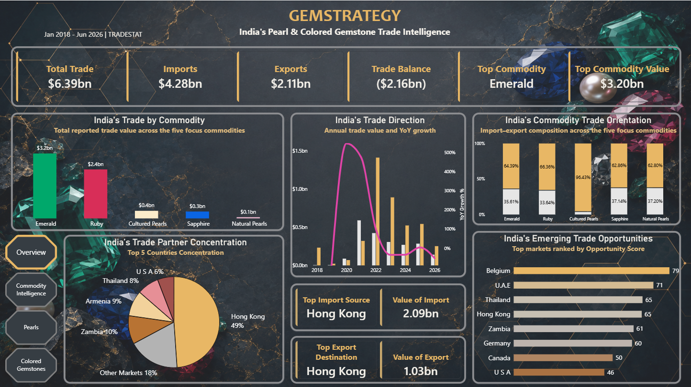
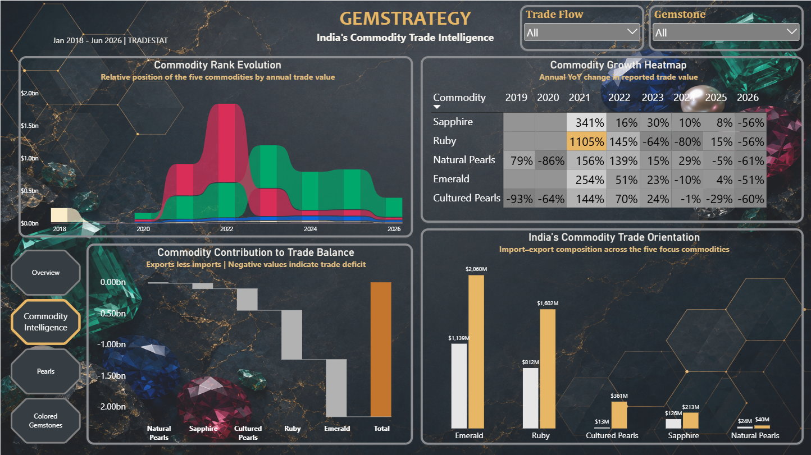
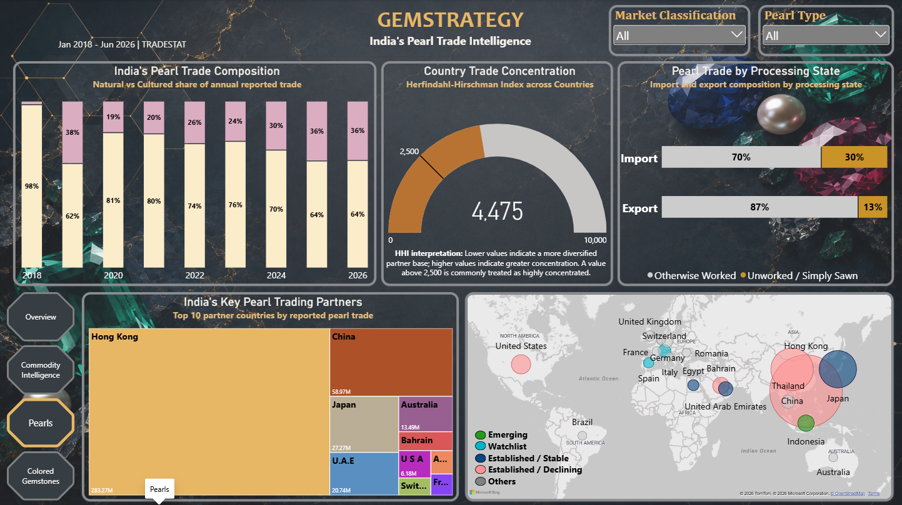
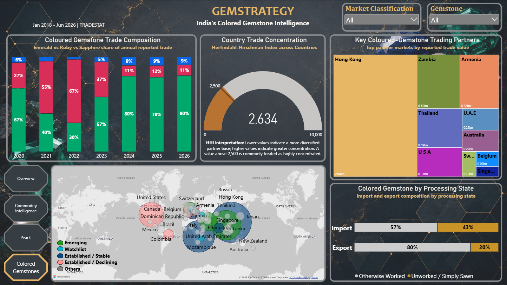

# GemStrategy

**An end-to-end trade intelligence platform for India's Pearl & Coloured Gemstone ecosystem**, built on real government trade data, automated data engineering, a SQL data model, and a Power BI analytics layer.

Covers **Natural Pearls, Cultured Pearls, Emerald, Ruby, and Sapphire** - India's monthly import/export activity by partner country, sourced directly from the Government of India's Department of Commerce (TRADESTAT), January 2018 through June 2026.

---

## Dashboard

### Overview
Headline KPIs, trade direction over time, commodity mix, partner concentration, and top emerging markets at a glance.



### Commodity Intelligence
How Natural Pearls, Cultured Pearls, Emerald, Ruby, and Sapphire compare - rank evolution over time, YoY growth heatmap, and each commodity's contribution to India's trade balance.



### Pearls
Natural vs. Cultured pearl trade, kept separate rather than merged into one generic "pearls" category - composition trend, supplier concentration (HHI), and top trading partners.



### Colored Gemstones
Emerald, Ruby, and Sapphire trade composition, concentration, and key trading partners, plus a market-classification map (Emerging / Watchlist / Established / Declining) built from a size + growth + persistence rule, not growth percentage alone.



---

## Why this exists

Public commentary on India's gems and jewellery trade skews heavily toward diamonds and precious metals. Pearls and coloured gemstones get far less granular analysis, even though official trade statistics already contain everything needed to answer real business questions: where India sources from, where it sells to, which markets are genuinely growing versus just noisy, and how concentrated (and therefore risky) that trade is.

GemStrategy turns the raw government reports into a structured, queryable, and visual answer to those questions.

## Data

- **Source**: Government of India, Department of Commerce - TRADESTAT (commodity-wise, country-wise import/export reports)
- **Scope**: 10 HS codes across 5 commodities, both import and export flows, monthly, Jan 2018 - Jun 2026
- **Currency**: US $ Million throughout (not converted - reported directly by TRADESTAT in that unit)
- **Grain**: Commodity x Country x Month x Trade Flow
- Raw government reports are kept in full (`gemstrategy_data/raw/`) so every number in the dashboard can be traced back to its source. Nothing is estimated, interpolated, or filled in for missing observations.

## Architecture

```
TRADESTAT (raw HTML reports)
        |
   scripts/  (Python: collect -> parse -> curate -> validate -> model)
        |
gemstrategy_data/  (curated fact tables + a SQL star schema)
        |
   GemStrategy Dashboard.pbix  (Power BI: DAX measures, 4-page report)
```

**Star schema**: `Dim_Date`, `Dim_Country` (131 countries, region-mapped), `Dim_HS_Code` (commodity name/group folded in - no separate junk dimensions), and `Fact_Trade` (37K+ rows). Available as a SQLite database and as plain CSVs.

## Repository layout

```
GemStrategy Dashboard.pbix     The dashboard
docs/
  Gemstrategy Project Proposal (CP1) Hiral Sarkar.pdf   Project scope document
  screenshots/                 Dashboard page captures (this README)
scripts/                       Data pipeline, run in this order
  gemstrategy_tradestat_USD_FIXED.py    TRADESTAT collector
  build_pearl_trade_csvs.py             Raw HTML -> curated pearl data
  build_gemstrategy_trade_csvs.py       + Emerald/Ruby/Sapphire -> combined dataset
  validate_gemstrategy_data.py          Data-quality checks
  build_sql_model.py                    Curated data -> SQL star schema
gemstrategy_data/
  raw/                          Untouched TRADESTAT HTML responses (full provenance)
  curated/                      Clean fact tables by commodity/flow
  powerbi_import/               The star schema as CSVs (Dim_Date, Dim_Country, Dim_HS_Code, Fact_Trade)
  gemstrategy.db                Same model as SQLite
  validation_report.md          Current data-quality state
hs_codes.csv                   The 10 HS codes in scope
requirements_gemstrategy.txt   Python dependencies
```

## Rebuilding the data

```bat
.venv\Scripts\python.exe scripts\build_pearl_trade_csvs.py
.venv\Scripts\python.exe scripts\build_gemstrategy_trade_csvs.py
.venv\Scripts\python.exe scripts\validate_gemstrategy_data.py
.venv\Scripts\python.exe scripts\build_sql_model.py
```

Then refresh the `.pbix` in Power BI Desktop (Home -> Refresh) - it reads from `gemstrategy_data/powerbi_import/`.

## Data quality

Every rebuild runs through automated checks: expected report coverage (2,040/2,040 report-months present), currency consistency, duplicate/null detection on the fact tables, and country-label review. Full detail in [gemstrategy_data/validation_report.md](gemstrategy_data/validation_report.md).

## Stack

Python (pandas, requests, BeautifulSoup, lxml) for collection and transformation - SQLite for the data model - Power BI and DAX for analysis and visualization.
